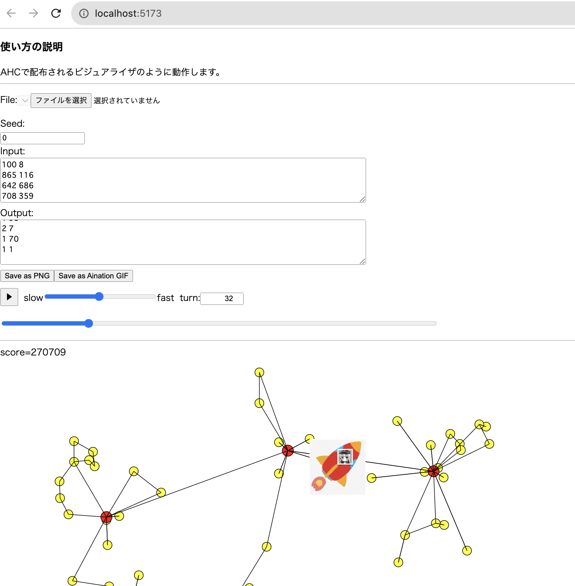

# ヒューリスティックコンテスト ビジュアライザ開発のためのテンプレート
AHCのビジュアライザと似た機能を持ったビジュアライザを開発する際のテンプレートです。
コンテストごとに以下の処理を書き換えると、そのコンテスト用のビジュアライザをwebアプリ上で動かすことができます。
- seedが与えられたときに入力を生成する機能
- 入力と出力が与えられたときに、ビジュアライザの最大ターン数を計算する機能
- 入力・出力・ターン数が与えられたときに、スコアとそのときに表示するSVGを出力する機能

なお、これらの処理はRustで記述されていて、WebAssemblyによってフロントエンドのJavaScriptから呼び出されます。

また、フロントエンド部分はReactで記述されていますが、機能拡張が必要でなければ触れる必要はありません。



## 使用に際しての注意
使用については自己責任でよろしくお願いいたします。

また、コンテスト中の短期間で使うには何を編集するかをあらかじめ理解しておく必要があります。
必要に応じてビジュアライザを作る練習をすると良いと思います。

# 使用方法
このアプリを動かすには以下の環境が必要です:
- Rustの実行環境
- wasm-pack (https://developer.mozilla.org/ja/docs/WebAssembly/Rust_to_Wasm)
- nodeの実行環境
- yarn

これらを用意するためには
```
cargo install wasm-pack
npm install -g yarn
```
などを実行する必要があります。

初回実行時には以下のコマンドを実行してください:
```
yarn  # nodeのモジュールのインストール
cd wasm && wasm-pack build --target web --out-dir ../public/wasm && cd .. # Rustのwasm化
yarn dev # サーバーの実行
```
これでローカルにwebアプリがホスティングされるので、コンソール上に表示されるURLにアクセスしてください。テンプレートの状態のビジュアライザが表示されると思います。

# ビジュアライザ開発の手順
初期状態ではコンテストの問題に固有の情報が含まれていないので、URLにアクセスしてもページの雛形しか出てきません。
Rustのテンプレートを適切に編集をして、問題ごとのビジュアライザを作っていきます。

具体的にはRustの関数を3つ実装する必要があります(wasm/src/lib.rs):
- gen(seed: i32) -> String: seedを与えてStringの形で入力ファイルを出力する関数
- vis(_input: String, _output: String, turn: usize) -> Ret: 入力・出力・ターン数を与えて、その時点のスコア・エラー文・SVGの画像を返す関数
- get_max_turn(_input: String, _output: String) -> usize: 入力・出力を与えたときに、その出力が何ターンからなるものかを計算する関数(スライダーで動かすときなどに必要)

これらを適切に実装して、wasmのディレクトリに移動し
```
wasm-pack build --target web --out-dir ../public/wasm
```
Rustの関数をJavaScriptから呼び出せるようにwasm化するとビジュアライザが動くようになります。

具体的な実装は、yukicoder-score-contest002ブランチやchokduai-contest-005ブランチを参考にしてください。

# AIコーディングエージェントによるビジュアライザ自動実装

Claude Code や Codex などのコーディングエージェントにビジュアライザを自動実装させることができます。

## 事前準備

リポジトリのルートに以下の2つを配置してください:

- `problem_description.txt` : AtCoderの問題文をコピペしたテキストファイル
- `tools/src/` : 公式から配布されるテスター・入力生成コード

## 使用方法

**Claude Code の場合**

`/make-visualizer` コマンドを実行すると、エージェントが自動でビジュアライザを実装します。

**Codex の場合**

`AGENTS.md` にビジュアライザの作成手順が記述されており、Codex は自動でそれを読み込みます。「ビジュアライザを実装して」と指示するだけで動作します。

## エージェントが行う作業

1. `problem_description.txt` と `tools/src/` が配置されているかチェック
2. 問題文を読んでビジュアライザの仕様を計画し、ユーザーに承認を求める
3. テスターのコードを流用しつつ `wasm/src/impl_vis.rs` にビジュアライザを実装
4. WASM のビルド (`wasm-pack build`)

> **注意**: ステップ3では `cat` コマンドでテスターのコードを結合します。また、ステップ4では `wasm-pack` や `cargo` を自動実行します。エージェントからコマンド実行の許可を求められた際は承認してください。

ビルド完了後は `yarn dev` でビジュアライザを起動して動作を確認してください。

> **免責事項**: AIエージェントの使用および生成されたコードの利用は自己責任でお願いいたします。

